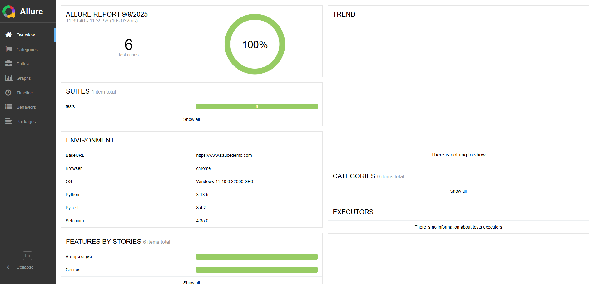

# Автоматизация тестирования сайта [SauceDemo](https://www.saucedemo.com/)

# Описание
Проект на Python 3.10+ с использованием Selenium и pytest. Реализованы тесты:
- успешная авторизация (`standard_user` / `secret_sauce`);
- отображение страницы каталога после входа;
- негативные сценарии авторизации;
- выход из системы через меню.

Подход: Page Object Model. Поддержан Allure Report. Статпроверки: mypy (strict), ruff.


#  Функционал

# Реализованные тесты
-  Проверка успешной авторизации пользователя (`standard_user` / `secret_sauce`)  
-  Проверка отображения страницы с товарами после входа  
-  Проверка негативных сценариев авторизации (невалидные логин/пароль)  
-  Проверка выхода из системы через меню  

# Дополнительные возможности
- Запуск тестов в разных браузерах (`--browser=chrome` / `--browser=firefox`)  
- Автоматическая установка драйверов через webdriver-manager  
- Формирование Allure-отчета (`allure serve allure-results`)  
- Строгая статическая типизация через mypy (strict mode)  
- Конфигурация маркеров и Allure в `pytest.ini`


#  Установка и запуск

# Требования
- Python 3.10+
- Google Chrome / Mozilla Firefox
- (Опционально) Allure CLI, Selenoid

# 1. Клонирование репозитория
```bash```
git clone https://github.com/<your-username>/<repo-name>.git
cd <repo-name>

# 2. Создание виртуального окружения
python -m venv venv
# Linux/Mac:
source venv/bin/activate
# Windows:
.\.venv\Scripts\Activate.ps1

# 3. Обновить pip и поставь зависимости
python -m pip install -U pip
if (Test-Path .\requirements.txt) {
    pip install -r requirements.txt
} else {
    pip install pytest selenium webdriver-manager allure-pytest mypy ruff
}

# 4. Запуск всех тестов 
pytest

# 5. Запуск только smoke-тестов
pytest -m smoke

# 6. Запуск тестов с указанием браузера
pytest --browser=firefox
pytest --browser=chrome

# 7. С поддержкой версий браузеров
pytest --browser=chrome --browser-version=120

# 8. Указание base-url по умолчанию https://www.saucedemo.com
pytest --base-url=https://www.saucedemo.com

# 9. Генерация Allure отчёта
allure serve allure-results

# Скриншоты



# 10. Проверка типизации
mypy .

# 11. Линтинг кода (ruff)
ruff check .


# 💻 Tech Stack:

